# PDF Processing Sequence Diagram

```mermaid
sequenceDiagram
    autonumber
    participant User
    participant IPC as IPC Handler
    participant Proc as pdf-processor
    participant TOC as toc-parser
    participant DB as Database
    participant Queue as job-queue
    participant Cache as pdf-cache
    participant Embed as embeddings
    participant Gen as content-generator
    participant API as Google AI API

    %% Phase 1: PDF Upload & Initial Processing
    rect rgb(40, 40, 80)
    Note over User,API: Phase 1: PDF Upload & Validation
    User->>IPC: Upload PDF file
    IPC->>Proc: processPdf(filePath)
    Proc->>Proc: await stat(file)
    Proc->>Proc: await readFile(file)
    Proc->>Proc: SHA256 hash
    Proc->>DB: Check duplicate (getPdfByHash)
    alt Duplicate found
        DB-->>Proc: existing PDF
        Proc-->>User: {duplicate: true}
    end
    Proc->>Proc: await copyFile → userData/pdfs/
    Proc->>DB: insertPdf()
    DB-->>Proc: pdfId
    end

    %% Phase 2: TOC Parsing
    rect rgb(40, 80, 40)
    Note over User,API: Phase 2: TOC Extraction
    Proc->>TOC: parseOutlineFromPdf(path)
    TOC->>TOC: pdfjs.getDocument()

    par Parallel metadata fetch
        TOC->>TOC: getMetadata()
        TOC->>TOC: getOutline()
        TOC->>TOC: getPageLabels()
    end

    alt Has PDF Outline
        loop For each outline item
            TOC->>TOC: getDestination() → pageNumber
            TOC-->>Proc: onChapter(title, page)
            Proc->>DB: insertChapter()
            Proc->>User: chapter:added event
        end
        Proc->>Gen: classifyChapterTitles()
        Gen->>API: LLM classify auxiliary
        API-->>Gen: classifications
        loop Update auxiliary flags
            Proc->>DB: updateChapterAuxiliary()
        end
    else No Outline - AI Parsing
        Proc->>TOC: parseTocStreaming(pages)
        TOC->>API: Stream TOC extraction
        loop For each streamed chapter
            API-->>TOC: chapter data
            TOC-->>Proc: onChapter(title, page)
            Proc->>DB: insertChapter()
        end
    end

    Proc->>Proc: detectPageOffset()
    Proc->>Proc: computePageBoundaries()
    loop Fix chapter boundaries
        Proc->>DB: updateChapterStartIdx()
        Proc->>DB: updateChapterEndIdx()
    end
    end

    %% Phase 3: Queue Jobs
    rect rgb(80, 40, 40)
    Note over User,API: Phase 3: Queue Processing Jobs
    loop For each chapter
        Proc->>DB: insertJob(embed, priority=1)
        Proc->>DB: insertJob(summary, priority=2)
        Proc->>DB: insertJob(concepts, priority=3)
    end
    Proc->>DB: insertJob(metadata, priority=4)
    Proc->>DB: insertJob(consolidate, priority=5)
    Proc->>Queue: startJobQueue()
    Proc-->>User: {pdfId, duplicate: false}
    end

    %% Phase 4: Process Embed Jobs
    rect rgb(60, 60, 100)
    Note over User,API: Phase 4: Chapter Embedding (per chapter)
    Queue->>DB: getNextPendingJob()
    DB-->>Queue: embed job
    Queue->>DB: getPdf(pdfId)
    Queue->>Cache: getCachedPdfData(filepath)

    alt Cache miss
        Cache->>Cache: PDFLoader.load()
        Cache->>Cache: pages.join('\\n\\n')
        Cache->>Cache: computePageBoundaries()
        Cache->>Cache: loadPageLabels()
        Cache-->>Queue: {pages, fullText, boundaries, labelMap}
    else Cache hit
        Cache-->>Queue: cached data
    end

    Queue->>Proc: processChapter(fullText, pages, labelMap)
    Proc->>Proc: RecursiveCharacterTextSplitter
    Proc->>User: chapter:progress (chunking)

    loop For each chunk
        Proc->>Proc: Find position (O(n) expected)
        Proc->>Proc: findPageFromCharIndex()
        Proc->>DB: insertChunk()
    end

    Queue->>DB: getChunksByChapterId()

    loop Batch embeddings (100 at a time)
        Queue->>Embed: generateEmbeddings(texts)
        Embed->>API: embedMany (text-embedding-004)
        API-->>Embed: embeddings[]
        loop Insert embeddings
            Queue->>DB: insertEmbedding(chunkId, vector)
        end
        Queue->>User: chapter:progress (embedding)
    end

    Queue->>DB: updateChapterStatus('done')
    Queue->>DB: updateJobStatus('done')
    end

    %% Phase 5: Process Summary Jobs
    rect rgb(100, 60, 60)
    Note over User,API: Phase 5: Chapter Summary (per chapter)
    Queue->>DB: getNextPendingJob()
    DB-->>Queue: summary job
    Queue->>Cache: getCachedPdfData(filepath)
    Cache-->>Queue: {fullText}
    Queue->>Queue: chapterText = fullText.substring(start, end)
    Queue->>Gen: generateChapterSummary(chapterText)
    Gen->>API: LLM summarize
    API-->>Gen: summary
    Queue->>DB: updateChapterSummary()
    Queue->>DB: updateJobStatus('done')
    end

    %% Phase 6: Process Concepts Jobs
    rect rgb(60, 100, 60)
    Note over User,API: Phase 6: Chapter Concepts (per chapter)
    Queue->>DB: getNextPendingJob()
    DB-->>Queue: concepts job
    Queue->>User: concepts:progress (extracting)
    Queue->>DB: getChunksByChapterId()
    Note over Queue: Reuses existing chunks!
    DB-->>Queue: chunks with page info
    Queue->>Gen: generateChapterConcepts(chunksWithPages)
    Gen->>API: LLM extract concepts (streaming)
    API-->>Gen: concepts[]
    Queue->>DB: insertConcepts() [transaction]
    Queue->>DB: updateChapterConceptsStatus('done')
    Queue->>User: concepts:progress (done)
    Queue->>DB: updateJobStatus('done')
    end

    %% Phase 7: Process Metadata Job
    rect rgb(100, 100, 60)
    Note over User,API: Phase 7: PDF Metadata
    Queue->>DB: getNextPendingJob()
    DB-->>Queue: metadata job
    Queue->>Cache: getCachedPdfData(filepath)
    Cache-->>Queue: {fullText}
    Queue->>Gen: generatePdfMetadata(fullText)
    Note over Gen: Uses first 20k chars only
    Gen->>API: LLM extract metadata
    API-->>Gen: {title, author, ...}
    Queue->>DB: updatePdfMetadata()
    Queue->>DB: updateJobStatus('done')
    end

    %% Phase 8: Consolidate Concepts
    rect rgb(100, 60, 100)
    Note over User,API: Phase 8: Consolidate Concepts
    Queue->>DB: getNextPendingJob()
    DB-->>Queue: consolidate job
    Queue->>User: concepts:progress (consolidating)
    Queue->>Gen: consolidatePdfConcepts(pdfId)
    Gen->>DB: getConceptsByPdfId()
    Gen->>API: LLM consolidate concepts
    API-->>Gen: consolidated concepts
    Gen->>DB: insertConcepts(consolidated)
    Queue->>User: concepts:progress (done)
    Queue->>DB: updateJobStatus('done')
    end

    %% Final State
    rect rgb(40, 80, 80)
    Note over User,API: ✅ PDF Fully Processed
    Queue->>Queue: checkPdfCompletion()
    Queue->>DB: updatePdfStatus('done')
    Note over User: All chapters enabled for chat!
    end
```



## Processing Timeline

```
Upload ──┬── TOC Parse ──┬── Queue Jobs
         │               │
         └── Validate    └── Chapter 1: embed → summary → concepts
                             Chapter 2: embed → summary → concepts
                             Chapter 3: embed → summary → concepts
                             ...
                             Metadata extraction
                             Concept consolidation
                             ✅ Done
```

## Key Optimizations Shown

1. **PDF Cache** - Single load, reused across all jobs
2. **Parallel TOC fetch** - metadata/outline/labels in parallel
3. **Chunk reuse** - Concepts job reuses embed job chunks
4. **Batch embeddings** - 100 chunks per API call
5. **Transaction batching** - Concept insertion in single transaction
